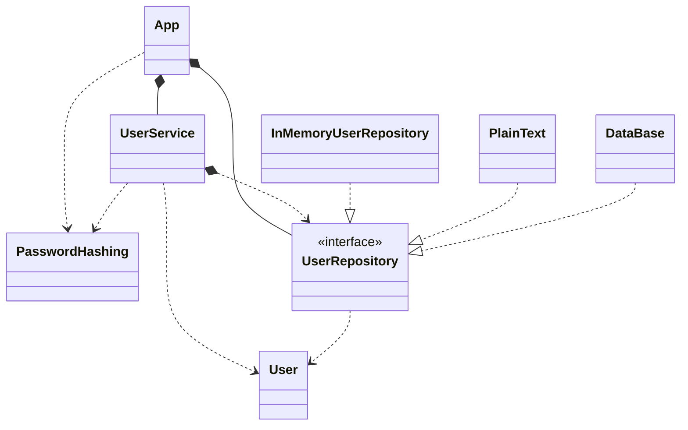

```mermaid
classDiagram
    direction TD

    class App
    class UserService
    class User
    class InMemoryUserRepository
    class PasswordHashing
    class UserRepository{<<interface>>}
    class DataBase
    class PlainText
    
    App *--UserService
    App *-- UserRepository
    
    UserService ..> User
    UserService *..> UserRepository
    UserRepository ..> User
    App ..> PasswordHashing
    UserService ..> PasswordHashing
    
    InMemoryUserRepository ..|> UserRepository
    PlainText ..|> UserRepository
    DataBase ..|>  UserRepository
```